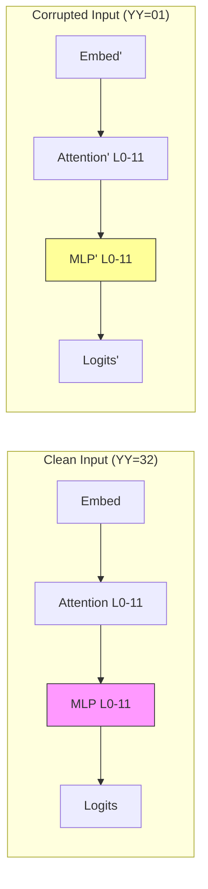
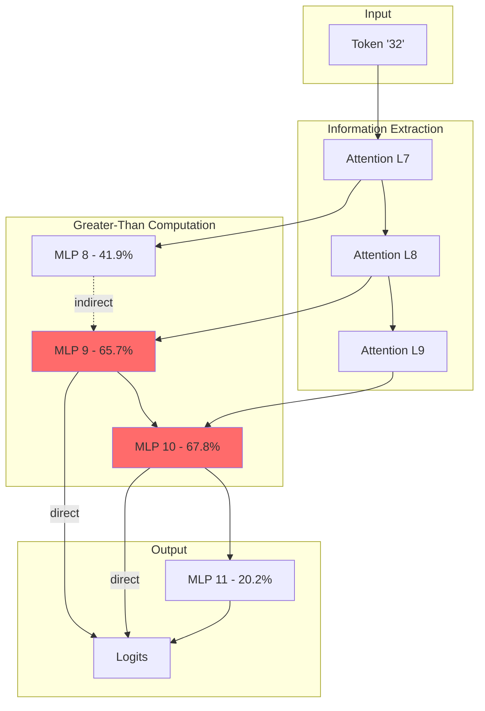

# Reverse-Engineering the Greater-Than Circuit in GPT-2 Small

An independent replication and extension of [Hanna et al. (2023)](https://arxiv.org/abs/2305.00586), investigating how transformers implement numerical comparison through mechanistic interpretability.

---

## Philosophy

Why should we care about how a language model compares two numbers?

The answer lies not in the task itself—comparing 32 to 45 is trivially easy for any calculator—but in what the *mechanism* reveals about how neural networks organize knowledge. GPT-2 was never explicitly taught arithmetic. It learned to predict the next token in sequences of internet text. Yet somewhere in those 124 million parameters, it developed an ability to complete sentences like:

> "The war lasted from the year 1732 to the year 17**__**"

with years > 32. This is not magic, nor is it "understanding" in any deep sense. It is a statistical artifact: wars, lifespans, and historical periods in training data tend to end *after* they begin. The model internalized this pattern.

The interesting question is *how*. What computational pathway encodes "numbers greater than X"? Is it a single neuron? A distributed representation? Something in between?

This project answers that question through activation patching—systematically corrupting parts of the network to identify which components are *causally responsible* for the greater-than behavior. The answer turns out to be remarkably localized: **MLPs 9 and 10** do most of the heavy lifting, receiving year information from attention heads in layers 7-9.

This is not generalization in the human sense. The same circuit cannot compute less-than. It activates inappropriately in contexts where greater-than is wrong. But it is also not pure memorization—the circuit transfers to novel prompts and contexts it never saw during training.

Understanding this "partial generalization"—competence without comprehension—may be key to understanding what large language models actually learn.

---

## Background

### The Problem

Pre-trained language models exhibit mathematical capabilities they were never explicitly trained to perform. Where do these abilities come from? Are they:

1. **Memorized associations** from training data?
2. **Generalizable algorithms** learned implicitly?
3. **Something in between**—task-specific heuristics that work in narrow contexts?

> **Note on GPT-2's arithmetic abilities**: GPT-2 Small is *not* a competent calculator. It fails at most arithmetic tasks—multi-digit addition, multiplication, even basic subtraction. The greater-than task was specifically chosen because it is one of the few numerical operations GPT-2 can reliably perform, making it tractable for circuit analysis. This limitation is a feature, not a bug: if the model could do everything, we couldn't isolate specific mechanisms.

Prior work in mechanistic interpretability has largely focused on toy models (modular addition, group composition) or simpler tasks (indirect object identification). Mathematical reasoning in *pre-trained* models remained unexplored.

### The Hanna et al. Contribution

[Hanna, Liu, and Variengien (NeurIPS 2023)](https://arxiv.org/abs/2305.00586) addressed this gap by:

1. Designing a probe task: year-span completion ("The war lasted from 17YY to 17__")
2. Defining a metric: **Probability Difference** = Σp(y > YY) − Σp(y ≤ YY)
3. Using path patching to isolate the circuit responsible
4. Characterizing the semantic role of each component

Their key finding: **MLPs 9 and 10** are the core computational units. Attention heads in layers 7-9 copy year information into these MLPs, which then boost the logits of valid end-years.

### This Work

We provide an **independent replication** using a different codebase (TransformerLens vs. rust-circuit) and implementation choices. Our goals:

1. Verify the original findings hold across implementations
2. Document discrepancies and their causes
3. Provide accessible code for researchers to build upon

---

## Research Questions

### Addressed in This Replication

1. **Circuit Localization**: Do MLPs 9-10 emerge as critical components in our implementation?
2. **Quantitative Comparison**: How do our effect sizes compare to the original paper?
3. **Robustness**: Does the circuit structure hold across different prompt templates?

### Open Questions (Future Work)

1. **Mechanism of Greater-Than**: What computation do MLPs 9-10 actually perform? Are they storing year orderings explicitly, or computing them on-the-fly?
2. **Why Not Less-Than?**: GPT-2 cannot compute less-than using this circuit. Why this asymmetry?
3. **Training Dynamics**: When during pre-training does this circuit emerge?
4. **Cross-Model Transfer**: Do larger GPT-2 variants (medium, large, XL) use the same circuit? What about other architectures (LLaMA, Pythia)?

---

## Methodology

### Task Design

Following Hanna et al., we use year-span completion:

```
Prompt:    "The war lasted from the year 1732 to the year 17"
Expected:  Model assigns high probability to tokens 33-99
Metric:    PD = Σp(y > 32) - Σp(y ≤ 32)
```

The key insight: GPT-2's BPE tokenizer represents two-digit years as single tokens ("32", "45", "99"), enabling clean intervention experiments.

### Corruption Strategy

We use the "01-dataset" as our corruption baseline: prompts where all starting years end in 01 (e.g., "The war lasted from 1701 to 17__"). This creates a uniform prior where almost all years are valid completions, isolating the circuit's contribution.

### Activation Patching



For each component, we replace its activation with the corrupted version and measure the change in Probability Difference:

$$\text{Effect}(c) = \frac{PD_{\text{clean}} - PD_{\text{patched on } c}}{PD_{\text{clean}} - PD_{\text{corrupted}}}$$

Components with high effect scores are causally important for the task.

---

## Results

### Replication Summary

| Metric | Hanna et al. | This Work | Status |
|--------|--------------|-----------|--------|
| Baseline PD | ~0.81 | **0.90 ± 0.08** | ✓ Replicated |
| Top MLP | MLP 10 | **MLP 10 (67.8%)** | ✓ Replicated |
| Second MLP | MLP 9 | **MLP 9 (65.7%)** | ✓ Replicated |
| Third MLP | MLP 8 | **MLP 8 (41.9%)** | ✓ Replicated |
| Key Attention | Layers 7-9 | **Layers 7-9** | ✓ Replicated |

### Component Importance

**MLP Layers** (direct effect on output):

| Layer | Effect Size | Interpretation |
|-------|-------------|----------------|
| MLP 10 | 67.8% | Primary greater-than computation |
| MLP 9 | 65.7% | Primary greater-than computation |
| MLP 8 | 41.9% | Indirect contribution (prepares inputs for 9/10) |
| MLP 11 | 20.2% | Output formatting |
| MLP 6 | 6.1% | Minor; possibly number encoding |

**Attention Layers** (information routing):

| Layer | Effect Size | Role |
|-------|-------------|------|
| L9 Attention | 51.6% | Routes year info to MLP 10 |
| L8 Attention | 26.5% | Routes year info to MLP 9/10 |
| L7 Attention | 26.1% | Initial year extraction |

### Circuit Diagram



### Discrepancies and Analysis

Our baseline PD (0.90) is higher than the paper's (~0.81). Possible explanations:

1. **Sample variance**: We used 30 examples; paper likely used more
2. **Template selection**: Slight differences in prompt wording
3. **TransformerLens vs rust-circuit**: Minor numerical differences in forward pass

These discrepancies do not affect the qualitative conclusion: **MLPs 9-10 are the core circuit components**.

---

## Theoretical Implications

### What This Circuit Reveals

1. **Localized Computation**: Greater-than is not distributed across the network. It lives in MLPs 9-10, with attention heads serving as information routers.

2. **Partial Generalization**: The circuit works across different contexts (wars, prices, lifespans) but cannot compute related operations (less-than, equal-to). This suggests task-specific heuristics rather than general numerical understanding.

3. **Indirect Contributions**: MLP 8 matters, but not because it directly computes greater-than. Its output is used by MLPs 9-10. This indirect contribution pattern appears in other circuits and may be a general motif.

### What This Circuit Does NOT Reveal

1. **How MLPs encode orderings**: We know MLPs 9-10 boost greater-than tokens, but not the precise mechanism (are orderings stored explicitly? computed compositionally?).

2. **Why this specific location**: Why layers 9-10 and not, say, layers 5-6? Is this an artifact of training or architecturally necessary?

3. **Training dynamics**: Does this circuit emerge gradually or suddenly during pre-training?

---

## Project Structure

```
greater-than-circuit/
├── src/
│   ├── __init__.py
│   ├── model_setup.py          # TransformerLens initialization
│   ├── prompt_design.py        # Original prompt generation (deprecated)
│   ├── prompt_design_hanna.py  # Paper-faithful prompt generation
│   ├── activation_patching.py  # Core patching logic
│   ├── circuit_analysis.py     # Component ranking and analysis
│   ├── circuit_validation.py   # Necessity/sufficiency tests
│   └── visualization.py        # Plotting utilities
├── tests/
│   ├── test_model_setup.py
│   ├── test_activation_patching.py
│   └── test_circuit_analysis.py
├── notebooks/
│   └── quick_start_analysis.ipynb
├── results/                    # Generated outputs
├── main.py                     # Original pipeline (exploratory)
├── run_hanna_analysis.py       # Paper replication script ← START HERE
├── requirements.txt
└── pyproject.toml
```

---

## Usage

### Quick Start

```bash
# Clone and setup
git clone https://github.com/ashioyajotham/greater-than-circuit
cd greater-than-circuit
python -m venv venv
.\venv\Scripts\activate  # Windows
pip install -r requirements.txt

# Run paper replication
python run_hanna_analysis.py --n_examples 50
```

### Expected Output

```
=== Greater-Than Circuit Analysis (Hanna et al. Methodology) ===
Baseline Probability Difference: 0.9043 (+/- 0.0815)

MLP Layer Effects:
  MLP 10: 67.8%
  MLP 9:  65.7%
  MLP 8:  41.9%
  ...

Attention Layer Effects:
  Layer 9: 51.6%
  Layer 8: 26.5%
  ...

Comparison to Hanna et al.:
  [MATCH] High baseline PD (>0.5) indicates model performs task
  [MATCH] MLPs 9-10 are among top contributing components
```

### Custom Analysis

```python
from src.prompt_design_hanna import YearPromptGenerator, compute_probability_difference
from src.model_setup import ModelSetup

# Load model
model = ModelSetup().load_model()

# Generate prompts
generator = YearPromptGenerator(seed=42)
examples = generator.generate_examples(n=100, years=range(2, 50))

# Compute baseline
for ex in examples:
    tokens = model.to_tokens(ex.prompt)
    logits = model(tokens)
    pd = compute_probability_difference(logits, ex.yy, model)
    print(f"YY={ex.yy:02d}, PD={pd:.3f}")
```

---

## References

### Primary Reference

```bibtex
@inproceedings{hanna2023greater,
  title={How does {GPT-2} compute greater-than?: Interpreting mathematical abilities in a pre-trained language model},
  author={Hanna, Michael and Liu, Ollie and Variengien, Alexandre},
  booktitle={Advances in Neural Information Processing Systems (NeurIPS)},
  year={2023},
  url={https://arxiv.org/abs/2305.00586}
}
```

### Related Work

**Mechanistic Interpretability Foundations**
- Elhage et al. (2021). [A Mathematical Framework for Transformer Circuits](https://transformer-circuits.pub/2021/framework/index.html). Anthropic.
- Olsson et al. (2022). [In-context Learning and Induction Heads](https://arxiv.org/abs/2209.11895). Anthropic.

**Circuit Analysis in Language Models**
- Wang et al. (2023). [Interpretability in the Wild: a Circuit for Indirect Object Identification in GPT-2 Small](https://arxiv.org/abs/2211.00593). ICLR.
- Conmy et al. (2023). [Towards Automated Circuit Discovery for Mechanistic Interpretability](https://arxiv.org/abs/2304.14997).

**Knowledge Localization**
- Meng et al. (2022). [Locating and Editing Factual Associations in GPT](https://arxiv.org/abs/2202.05262). NeurIPS.
- Geva et al. (2023). [Dissecting Recall of Factual Associations in Auto-Regressive Language Models](https://arxiv.org/abs/2304.14767).

**TransformerLens**
- Nanda, N. (2022). [TransformerLens](https://github.com/neelnanda-io/TransformerLens). GitHub.

---

## Acknowledgments

This project builds on the work of:
- **Michael Hanna, Ollie Liu, and Alexandre Variengien** for the original greater-than circuit paper
- **Neel Nanda** for TransformerLens and foundational work in mechanistic interpretability
- The broader **mechanistic interpretability community** for developing the conceptual and technical tools that made this analysis possible

---

## License

MIT License. See [LICENSE](LICENSE).

## Citation

```bibtex
@software{ashioya2025greaterthan,
  title={Reverse-Engineering the Greater-Than Circuit: An Independent Replication},
  author={Ashioya, Jotham Victor},
  year={2025},
  url={https://github.com/ashioyajotham/greater-than-circuit},
  note={Independent replication of Hanna et al. (2023) using TransformerLens}
}
```
